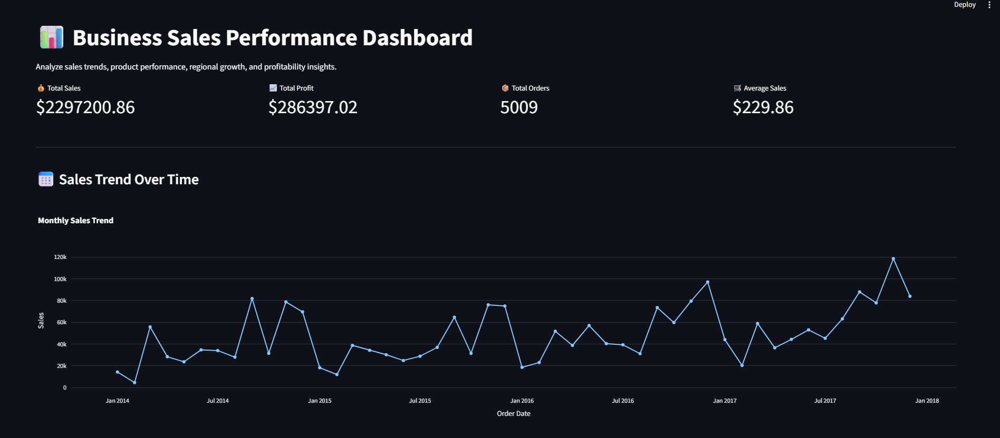
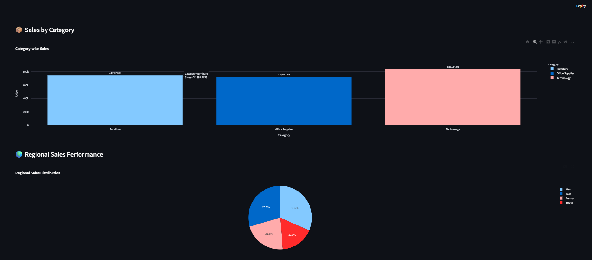
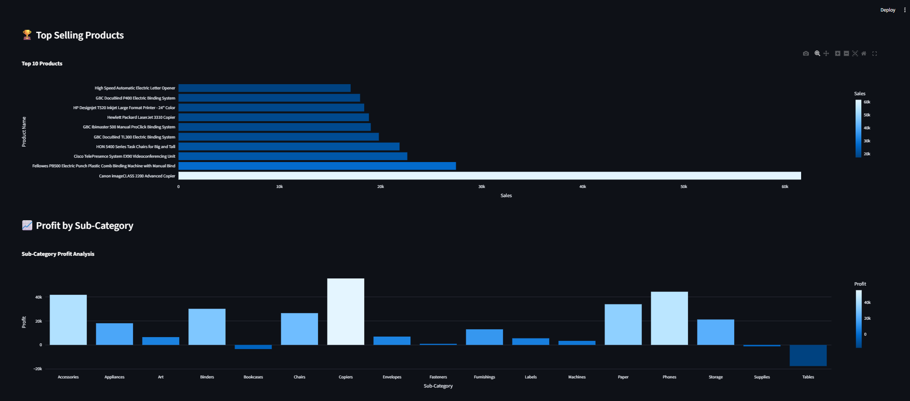
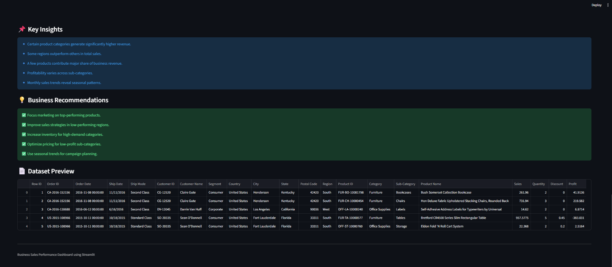

# FUTURE_DS_01

## 📌 Project Overview

This project focuses on analyzing business sales performance using retail sales data.

The dashboard helps businesses:
- Track sales and profit trends
- Identify top-selling products
- Analyze regional performance
- Understand category-wise profitability
- Generate business-focused recommendations

The project is built using Python and Streamlit to create an interactive analytics dashboard.

---

# 🎯 Objectives

- Analyze revenue trends over time
- Identify high-performing products and categories
- Compare sales performance across regions
- Measure profitability
- Generate actionable business insights

---

# 🛠 Tools & Technologies Used

| Tool | Purpose |
|---|---|
| Python | Data analysis |
| Pandas | Data cleaning & processing |
| Plotly | Interactive charts |
| Streamlit | Dashboard development |
| VS Code | Development environment |

---

# 📂 Project Structure

```text
business-sales-analysis/
│
├── app.py
├── requirement
├── superstore.csv
├── README.md
│
├── Images/
│   ├── image.png
│   ├── image copy.png
│   ├── image copy 2.png
│   └── image copy 3.png
```

---

# 📊 Dashboard Features

## ✅ KPI Metrics
- Total Sales
- Total Profit
- Total Orders
- Average Sales

## ✅ Sales Trend Analysis
Visualizes:
- Monthly sales performance
- Revenue growth trends

## ✅ Product & Category Analysis
Analyzes:
- Top-selling products
- Category-wise sales
- Profitability performance

## ✅ Regional Analysis
Compares:
- Regional sales contribution
- Business performance by region

## ✅ Business Recommendations
Provides actionable strategies to improve business growth and profitability.

---

# 📈 Key Insights

- Certain categories generate significantly higher revenue
- Top products contribute major share of total sales
- Regional performance varies across business locations
- Some sub-categories have lower profitability
- Monthly sales trends reveal seasonal patterns

---

# 💡 Business Recommendations

- Focus marketing on high-performing products
- Improve strategies in low-performing regions
- Optimize pricing for low-profit categories
- Improve inventory planning
- Use seasonal trends for business campaigns

---

# 📉 Dashboard Screenshots

## 📌 Dashboard Overview

### Dashboard Image 1


### Dashboard Image 2


### Dashboard Image 3


### Dashboard Image 4


---

# 📥 Dataset

Dataset Used:
Superstore Sales Dataset

Dataset Source:
https://www.kaggle.com/datasets/vivek468/superstore-dataset-final

---

# ▶️ How to Run the Project

## Step 1: Install Required Libraries

```bash
pip install -r requirement
```

## Step 2: Run Streamlit Application

```bash
streamlit run app.py
```

---

# 🌐 Dashboard Access

After running the application:

```text
http://localhost:8501
```

---

# 🚀 Future Improvements

- Add predictive sales forecasting
- Add customer segmentation
- Deploy dashboard online
- Add real-time analytics

---

# 📚 Skills Gained

- Sales Analytics
- Business Intelligence
- KPI Analysis
- Dashboard Development
- Data Visualization
- Business Reporting

---

# 👩‍💻 Author

Business Sales Performance Analytics using Python and Streamlit.
